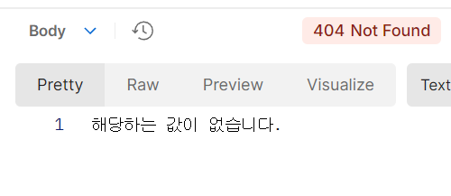

## 일정 관리 앱 V2

JDBC로 구현했던 기존 일정 관리 앱과 달리 JPA를 이용해 더 객체지향적인 일정 관리 앱을 개발하는 프로젝트

### 커밋 컨벤션
<details>
<summary>컨벤션</summary>


<b>아래와 같은 형식을 따라 커밋하세요.</b>

```text
<타입>: <제목>

<본문>

<꼬리말>
```

1. 커밋 타입


   - 🆕: 새 기능 추가


   - 🔧: 기능 수정 & 개선


   - 🐛: 버그 수정


   - 📝: 문서 추가 / 수정


   - 🎨: 코드 스타일 변경(들여쓰기 등)


   - 🏭: 코드 리팩토링(기능 변경 없이 구조만 개선한 경우)


   - 📁: 파일 구조 변경


2. 제목: 해당 커밋에 대한 간략한 설명

   - 예) Main 클래스 리팩토링


3. 본문(선택 사항): 이 커밋에 대한 추가 설명


4. 꼬리말(선택 사항): 기타 참고사항 기술

</details>


### 구현 기능들


#### 1. CRUD
- 회원, 일정 및 댓글에 대해 CRUD를 지원하는 API를 구현하였다.
  
  

- 조회 기능으로는 식별자를 이용한 조회 및 전체 조회를 구현하였다.


#### 2. 로그인 & 사용자 인증
- 요청 방식이 whiteList에 등록되지 않았다면 세션(쿠키)를 요구하도록 구현하였다.
  
  

  
- 로그인 시 해당 요청들이 정상적으로 수행된다.


#### 3. 예외처리 적용
- 사용자의 입력을 검증해 값이 의도와 다른 경우, 쿼리 수행에 문제가 생긴 경우 등을 
  @ControllerAdivce를 통해 전역적으로 관리해 각 경우에 알맞은 응답을 반환하도록 하였다.
  
  


#### 4. 일정 페이징 조회
- 일정 조회 시 페이징을 활용할 수 있도록 하였다.
  
  


- 전체 일정 사이즈보다 큰 페이지 사이즈 요청 시 가능한 모든 일정을 전송한다.
  
  


#### 5. 비밀번호 암호화
- 회원가입할 때 패스워드는 원문이 아닌 해시 함수를 거친 결과값으로 저장된다.
- 이후 로그인 시 요청으로 받은 비밀번호 값과 저장된 해시 값의 원문이 서로 일치하는지 확인한다.


#### 6. API 문서 자동 생성
- Swagger를 도입해 프로젝트 실행 시 자동으로 API 문서를 생성하고 아래와 같은 엔드포인트로 접근할 수 있도록 했다.
  - <b>JSON 형식 API 문서: /v3/api-docs</b>
    


  - UI 적용된 API 문서: /swagger-ui.html
    

#### 7. HTTP Request & Response Logging
- Filter를 통해 HTTP 요청 및 응답을 로깅하도록 구현하였다.


- 요청 로깅
  


- 응답 로깅
  


### TroubleShooting

[TroubleShooting 기록들](https://velog.io/@mikejigglypuf/series/%EC%9D%BC%EC%A0%95-%EA%B4%80%EB%A6%AC-%EC%95%B1-V2-TroubleShooting)